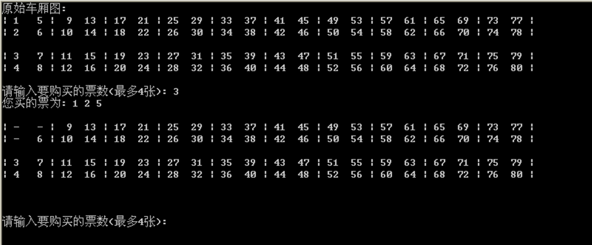

# 程序说明

题目要求：编写程序实现火车站售票程序（以一节车厢为例）。
下图是火车车厢内座位的布局，座位号从1到80；
其中1、2、 5、6位于一个间隔内，3、4、7、8也是一个间隔内的座位…

### 售票规则总则：
1.	假设每次最多售4张；
2.	售1张票原则：随便售出一张没有售出的票；
3.	售2张票原则：优先售2张相邻的票、如果没有2张相邻的票就随便售出两张票；所谓2张相邻包括：1和2;  3和4;  5和6;  7和8等等；以下情况不算相邻: 1和5;  2和3等等
4.	售3张或4票原则：优先售一个间隔内的票；
注：随便售出：可以指定从小号开始。如果剩余票数不足，就提示不足, 不售票。如果不能满足优先原则, 则可从小号票开始出售。

### 程序要求：
1. 定义存储车厢座位信息的数据结构和相关状态信息；
2. 编写程序模拟售票过程，售票张数n由用户输入。(n = 1,2,3,4)
3. 程序输出如下所示：

